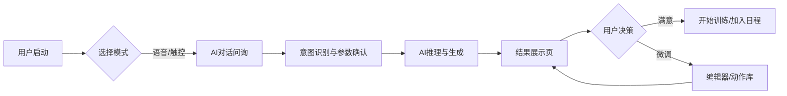

# AI推荐系统产品需求文档 (PRD)

| 文档版本 | V1.0 |
| :--- | :--- |
| **文档状态** | 正式发布 |
| **撰写日期** | 2026-01-20 |
| **对应Demo** | AI推荐Demo_智能版.html (V26.0) |

---

## 1. 产品概述

### 1.1 背景
传统的健身APP推荐往往基于静态模板，缺乏对用户实时状态（如疲劳度）、临时需求（如时间紧迫）及个性化偏好（如动作厌恶）的动态响应。AEKE AI Coach 旨在通过对话式交互和智能算法，提供“千人千面”的实时训练解决方案。

### 1.2 产品目标
- **极致个性化**：基于用户档案、疲劳状态和即时需求，生成秒级响应的定制课程或计划。
- **交互拟人化**：通过语音/文本对话形式，模拟真人教练的问询与决策过程。
- **过程透明化**：展示AI推理过程（Reasoning View），增强用户对推荐结果的信任。
- **高度可控性**：提供专业级的微调编辑器，允许用户对生成结果进行深度定制。

### 1.3 目标用户
- **初级用户**：不知道练什么，依赖AI全托管推荐。
- **进阶用户**：有明确目标，需要AI辅助生成框架，并支持手动微调细节。

---

## 2. 用户角色与流程

### 2.1 核心用户流程

---

## 3. 功能需求详情

### 3.1 模块一：AI 助手与首页 (Home & Assistant)

#### 3.1.1 虚拟形象与状态
- **Siri-like 动效**：首页常驻 AI 虚拟形象（光球/轨道），具备以下状态：
    - **待机**：缓慢呼吸律动。
    - **聆听中**：光球扩散，轨道加速，反馈麦克风收音状态。
    - **思考中**：颜色变换（如变蓝），高频闪烁。
    - **表达中**：波形律动，配合 TTS 语音输出。

#### 3.1.2 语音/多模态交互
- **唤醒机制**：支持点击麦克风图标或特定语音指令唤醒。
- **意图识别**：
    - **快捷指令**：识别“给我一节课”、“制定计划”等关键词直接进入对应流程。
    - **参数提取**：从自然语言中提取关键参数（如“练胸”、“30分钟”、“周一三五”）。
    - **模糊匹配**：支持非标准表述（如“练大腿”映射为“腿部”）。
- **实时字幕**：用户说话时，屏幕实时显示识别到的文本字幕。

#### 3.1.3 快捷入口
- **一键生成**：提供“给我一节课”和“给我一份计划”两个高频入口。
- **档案概览**：底部卡片展示用户核心画像（目标、等级、体重、疲劳度），支持点击展开编辑。

---

### 3.2 模块二：运动档案与疲劳管理 (Profile & Fatigue)

#### 3.2.1 档案管理
- **基础数据**：性别、生日（自动计算年龄/最大心率）、身高、体重（自动计算BMI）、静息心率。
- **训练偏好**：
    - **运动等级**：L1-L5。
    - **时间预算**：每日运动时长。
    - **风控禁忌**：疼痛部位（多选）、缺失器械（多选）。
    - **日程偏好**：每周训练日（如周一、三、五）。
- **目标设定**：主要目标（增肌/减脂/健康）、功能目标（力量/耐力/心肺等）、目标体型/体重。

#### 3.2.2 疲劳度模型
- **主观评分**：用户输入 1-10 分的主观疲劳度。
- **状态映射**：
    - **1-2 (超量恢复)**：适合冲击 PR。
    - **3-4 (完全恢复)**：适合常规高容量训练。
    - **5-6 (功能性疲劳)**：建议中等强度。
    - **7-8 (非功能性疲劳)**：建议减载或主动恢复。
    - **9-10 (过度训练)**：强制休息。
- **风控干预**：当用户选择处于疲劳状态的部位时，AI 需触发拦截对话，建议切换部位或降低难度。

---

### 3.3 模块三：对话式生成向导 (Chat Wizard)

#### 3.3.1 课程生成流 (Course Flow)
- **步骤1：类型选择**
    - 询问：“想练点什么？”
    - 选项：力量、HIIT、有氧、瑜伽、普拉提等。
- **步骤2：部位/目标选择**
    - 询问：“重点想练哪个部位？”
    - 选项：全身、胸部、背部、腿部等（支持多选）。
    - **疲劳拦截**：若选中疲劳部位，弹出警告并推荐替代方案。
- **步骤3：时长设定**
    - 询问：“今天有多少时间？”
    - 交互：滑块选择（20-90分钟）。

#### 3.3.2 计划生成流 (Plan Flow)
- **步骤1：周期设定**
    - 询问：“计划持续多久？”
    - 交互：滑块选择（1-24周）。
- **步骤2：日程安排**
    - 询问：“每周哪几天训练？”
    - 交互：星期多选芯片（支持语音“周末不练”、“只练工作日”等复杂指令）。
- **步骤3：单课时长**
    - 询问：“每天平均训练多久？”

#### 3.3.3 推理展示 (Reasoning View)
- 在生成结果前，展示 AI 的决策日志，提升即视感：
    1. 读取档案（分析用户画像）。
    2. 解析需求（意图与参数）。
    3. 风控扫描（避开伤病/疲劳部位）。
    4. 策略匹配（加载训练范式与负荷策略）。
    5. 构建课程（动作筛选与排编）。

---

### 3.4 模块四：结果页与编辑器 (Result & Editor)

#### 3.4.1 课程结果页
- **头部信息**：课程标题、副标题（时长/部位/等级）、单位切换（KG/LBS）。
- **统计栏**：总时长、动作数量、总容量（组数）、预估消耗（Kcal）。
- **环节结构**：按 热身 -> 主训 -> 放松 展示动作列表。
- **环节操作**：每个环节底部提供“+ 添加动作”入口，允许用户从动作库中补充动作。
- **全局控制**：
    - **负荷策略**：切换 恒定 / 递增（金字塔） / 递减 / 计时。
    - **循环模式**：切换 常规组 / 循环组 / 超级组（需校验拮抗肌关系）。

#### 3.4.2 专业动作卡片 (Pro Action Card)
- **折叠态**：展示动作缩略图、名称、部位标签、摘要（如 "4组 x 12次 20kg"）。
- **展开态**：
    - **组详情列表**：每一组的 序号、重量、次数/时长。
    - **编辑功能**：支持修改单组数据、删除组、添加组。
    - **底部信息**：显示强度百分比（%1RM）、RPE、组间休息时间。
- **工具栏**：
    - **替换**：打开动作库替换当前动作。
    - **排序**：上移/下移动作。
    - **删除**：将当前动作从课程中移除。
    - **折叠/展开**：切换详情显示。

#### 3.4.3 计划结果页
- **阶段划分**：按 适应期 -> 进阶期 -> 突破期 -> 减载期 展示。
- **周视图**：展示每周的训练安排。
- **日详情**：
    - **训练日**：显示当日训练主题（如“上肢力量”）、部位、时长。点击可进入该日的**课程结果页**进行详细预览。
    - **休息日**：显示休息状态。
- **加入日程**：确认后将计划写入用户日历。

---

### 3.5 模块五：动作库与筛选 (Library)

#### 3.5.1 筛选器
- **部位筛选**：支持按部位（胸/背/腿等）快速过滤。
- **智能排序**：基于匹配度（Match Score）排序，优先展示符合当前课程目标、器械条件且近期未练的动作。

#### 3.5.2 动作列表
- 展示动作名称、部位、器械要求、难度等级。
- 选中动作后，返回编辑器替换原动作，并自动重新计算负荷参数。

---

## 4. 核心算法逻辑 (Logic Specs)

### 4.1 课程生成逻辑
1.  **上下文构建**：合并用户档案、输入参数、疲劳状态。
2.  **环节规划**：
    - **热身/放松**：基于流式范式，时长占比约 15%。
    - **主训**：基于抗阻或间歇范式，时长占比约 70%。
    -   **自适应调整 (Time-Constraint Adaptation)**：若总时长 ≤ 30min，根据目标差异化压缩组间休息（力量≤120s, 增肌≤60s, 减脂/心肺≤45s）；若动作数量不足，自动降低组数以换取多样性。
3.  **动作筛选**：
    - **硬过滤**：剔除 禁忌部位（伤病/疲劳）和 缺失器械 的动作。
    -   **软打分**：新鲜度（+60）、收藏（+50）、难度匹配（+30）、厌恶（-80）；引入随机扰动分值（Noise）避免排序固化。
    -   **Top-K 随机策略**：从高分候选中随机抽取，避免结果单一。
    -   **缺口填充 (Gap Filling)**：若筛选出的动作不足以填满时长，自动增加已选动作的组数（循环+1）直至满足时长预算，单动作组数设有熔断上限（如6组）。
4.  **参数实例化**：
    - **负荷优先模式**（力量）：基于 1RM % 计算重量，基于强度反推次数。
    - **容量优先模式**（HIIT/有氧）：基于时长或固定次数。
    - **组间策略**：应用金字塔（递增）或恒定策略生成每组数据。

### 4.2 计划生成逻辑
1.  **模板匹配**：基于用户周频、目标（增肌/减脂）及**性别**（如“三分化”区分男/女侧重），匹配最佳的单周循环模板。
2.  **周期规划**：
    - **<4周**：压缩周期，仅保留进阶期/突破期。
    - **≥4周**：完整周期（适应->进阶->突破->减载）。
3.  **日程填充**：将模板槽位映射到用户具体的训练日（如周一练推，周三练拉）。

---

## 5. 非功能需求

### 5.1 性能要求
- **生成速度**：单次课程生成耗时 < 1秒（前端计算）。
- **语音响应**：语音识别上屏延迟 < 200ms。

### 5.2 交互体验
- **容错性**：语音输入支持模糊匹配（如“练胸肌”=“胸部”）。
- **反馈**：所有关键操作（生成、保存、修改）需有 Toast 或 语音反馈。
- **动画**：视图切换需有平滑过渡，AI 思考需有动效支撑。

### 5.3 离线能力
- 系统应内置基础动作库（Fallback Data），确保在无网络环境下仍能生成基础课程。

---

## 6. 数据埋点需求

| 事件ID | 事件名称 | 关键参数 |
| :--- | :--- | :--- |
| `flow_start` | 开始流程 | `type` (course/plan), `source` (voice/click) |
| `voice_input` | 语音输入 | `text` (识别文本), `step` (当前步骤) |
| `course_generated` | 课程生成成功 | `duration`, `targets`, `action_count` |
| `plan_generated` | 计划生成成功 | `cycle`, `freq`, `template_id` |
| `action_replace` | 动作替换 | `original_id`, `new_id` |
| `param_edit` | 参数微调 | `field` (weight/reps/sets) |
| `start_training` | 开始训练 | `course_id` |