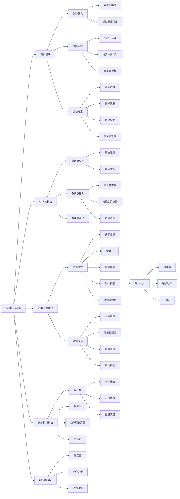
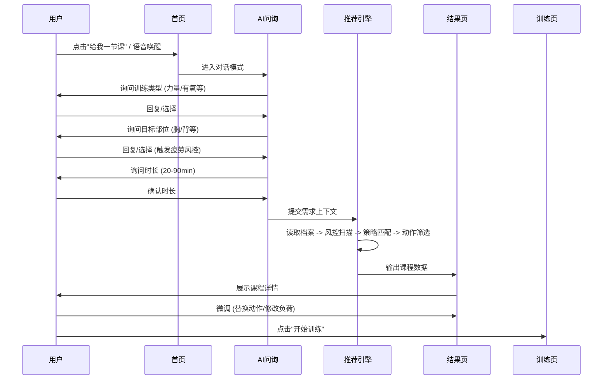

# AI推荐_智能版_功能交互 [PRD]

| 文档版本 | V27.0 |
| :--- | :--- |
| 文档状态 | **已发布** |
| 撰写日期 | 2026-01-26 |
| 密级 | 内部绝密 |

---

## 1. 产品概述
**AEKE Coach** 是一款基于运动科学与 AI 算法的智能健身生成器。它通过多模态交互（语音/触控）收集用户数据与即时需求，利用八层决策模型实时生成个性化的单次课程或周期性训练计划，并提供可视化的推理过程与专业级的执行监控。

---

## 2. 功能架构图 (Mind Map)

---

## 3. 业务流程图

### 3.1 主线流程 (生成课程)

---

## 4. 页面详细说明

### P1: 首页 (Home)
*   **功能**: APP 启动页与状态中心。
*   **核心交互**:
    *   **Siri-like 虚拟形象**: 位于屏幕上方，通过呼吸、扩散、波形等动效反馈 AI 状态。
    *   **启动按钮**: 屏幕中央圆形触控区，点击唤醒语音助手。
    *   **快捷入口**: "给我一节课"、"给我一份计划"、"自定义课程模板"。
    *   **档案卡片**: 底部展示核心指标（目标、等级、体重、疲劳度），点击可编辑。

### P2: 智能问询 (Chat Wizard)
*   **功能**: 模拟真人教练的对话式需求收集。
*   **交互**:
    *   **对话流**: AI 提问 -> 用户回答（语音/点击芯片）。
    *   **动态输入**: 根据问题类型展示不同控件（芯片列表、数值滑块）。
    *   **疲劳拦截**: 若选择疲劳部位，AI 发出警告并建议切换。

### P3: 推理演示 (Reasoning)
*   **功能**: 可视化 AI 计算过程，建立信任。
*   **展示**: 逐行滚动显示推理日志（读取档案 -> 解析需求 -> 风控扫描 -> 策略匹配 -> 构建课程）。

### P4: 方案结果 (Result)

#### 模式 A: 单课结果
*   **头部**: 课程名称、标签（等级/时长/部位）、简介。
*   **统计**: 时长、动作数、容量、消耗。
*   **环节导航**: 热身 / 主训 / 放松 Tab 切换。
*   **微调控制台**:
    *   **全局策略**: 调整负荷策略（推荐/恒定/递增/递减/自定义）、循环模式、组间休息。
    *   **动作卡片**: 展开可编辑每一组的负荷与次数，支持替换、排序、删除。

### 4.X 负荷策略交互逻辑详解
> **定义**：控制动作组间负荷（重量/次数）的变化趋势。
> **入口**：课程结果页 -> 环节微调控制台 -> 负荷策略下拉框。

#### 1. 策略定义
| 策略名称 | 逻辑描述 | 适用场景 |
| :--- | :--- | :--- |
| **推荐** | 恢复为 AI 初始生成的默认配置。 | 初始状态 |
| **恒定** | 所有组负荷保持一致。 | 力量耐力、新手入门 |
| **递增** | 负荷逐组增加（正金字塔），最后一组最重。 | 肌肥大、力量突破 |
| **递减** | 负荷逐组减少（倒金字塔），第一组最重。 | 爆发力、力竭训练 |
| **自定义** | 用户自由编辑，组间无联动。 | 高级用户 |

#### 2. 策略切换逻辑
> **核心原则**：**锚点锁定**。切换策略时，取当前所有组中的**最大值**作为基准（锚点），重新计算其他组数值，确保强度不掉阶。

*   **步骤 A: 确定锚点**
    *   **力量动作**：取当前所有组`重量`的最大值。
    *   **自重/计时动作**：取当前所有组`次数/时长`的最大值。
*   **步骤 B: 计算步进**
    *   **力量动作**：`Max(0.5kg, 1RM * 5%)`。
    *   **自重/计时动作**：`Max(1, 锚点值 * 10%)`。
*   **步骤 C: 应用公式**
    *   设总组数为 `N`，当前组索引为 `i` (0 ~ N-1)。
    *   **恒定**：所有组 = 锚点。
    *   **递增**：`第i组 = 锚点 - (N - 1 - i) * 步进`。(锚点在最后)
    *   **递减**：`第i组 = 锚点 - i * 步进`。(锚点在最前)
    *   **推荐**：重置为 AI 初始推荐数据。
    *   **自定义**：不做计算，仅解除联动。
*   **步骤 D: 衍生参数重算**
    *   仅针对**力量动作**：修改`重量`后，自动反推建议`次数`，保持 RPE 恒定。

#### 3. 手动微调逻辑
> 用户直接修改某一组数值时的系统响应。

*   **场景 A: 自定义策略**
    *   **逻辑**：仅更新当前组数值，不影响其他组。
*   **场景 B: 推荐策略**
    *   自动切换为**递增**策略，并触发场景 C 逻辑。
*   **场景 C: 递增/递减策略**
    *   若修改了**第一组**或**最后一组** (且总组数 > 2)：
    *   **线性插值**：保持首尾数值不变，自动重算中间组数值，使其平滑过渡。
*   **场景 D: 修改力量动作重量**
    *   **RM联动**：自动更新该组的`次数`为理论最大次数。

#### 4. 类型差异处理
| 维度 | 力量动作 | 自重/计时动作 |
| :--- | :--- | :--- |
| **调节对象** | **重量** | **次数/时长** |
| **从属参数** | 次数 (随重量自动变化) | 无 |
| **步进精度** | 0.5 kg | 1 次 / 1 秒 |

### 4.Y 循环模式交互逻辑详解
> **定义**：控制环节内动作的执行顺序与休息安排。
> **入口**：课程结果页 -> 环节微调控制台 -> 循环模式下拉框。

#### 1. 模式定义
| 模式名称 | 逻辑描述 | 适用场景 |
| :--- | :--- | :--- |
| **常规** | 顺序执行。完成一个动作的所有组数后，再做下一个动作。 | 肌肥大、力量举 |
| **循环** | 交替执行。依次完成所有动作的第一组，再进行下一轮。 | 减脂、心肺耐力 |

#### 2. 执行序列逻辑
> 假设环节内有 2 个动作 (A, B)，每个动作 3 组。

*   **常规模式**
    *   **序列**：`A1 -> 休息 -> A2 -> 休息 -> A3` -> **转场(轮间)** -> `B1 -> 休息 -> B2 -> 休息 -> B3`
*   **循环模式**
    *   **序列**：`A1 -> 休息(换项) -> B1` -> **大休(轮间)** -> `A2 -> 休息(换项) -> B2` -> **大休(轮间)** -> `A3 -> 休息(换项) -> B3`

#### 3. 休息时间应用规则
| 时间类型 | 常规模式 | 循环模式 |
| :--- | :--- | :--- |
| **组间休息** | 同一动作，组与组之间的休息 (A1->A2) | 动作切换时的过渡时间 (A1->B1) |
| **轮间休息** | 动作切换时的过渡时间 (A->B) | 完成一整轮大循环后的休息 (Round 1 -> Round 2) |

#### 4. 异常处理
*   **组数不一致**：若循环模式下，动作 A 有 3 组，动作 B 有 4 组。
    *   **逻辑**：前 3 轮正常循环 (A+B)。第 4 轮仅执行 B (跳过 A)。
    *   **UI表现**：执行界面自动跳过已完成所有组数的动作。

#### 模式 B: 计划结果
*   **概览**: 周期、频率、痛点与效果。
*   **图表**: 体重预测曲线（SVG 折线图）。
*   **阶段流程**: 适应期 -> 进阶期 -> 突破期 -> 减载期。
*   **周历**: 展示每日安排，点击训练日可下钻至单课详情。

### P5: 动作库 (Library)
*   **功能**: 浏览与选择动作。
*   **交互**:
    *   **筛选**: 部位、器械、难度、冲击等级。
    *   **操作**: 选中动作进行替换或添加。
    *   **详情**: 点击查看视频演示、肌群映射、历史数据。

### P6: 训练执行 (Workout)
*   **功能**: 跟练与实时监控。
*   **界面**:
    *   **视频区**: 动作演示、倒计时、休息遮罩。
    *   **仪表盘**: 实时功率图 (L/R)、重量表盘 (支持拖拽调整)、行程曲线。
    *   **列表浮层**: 查看当前课程进度，支持快速跳转。
*   **模拟**: 提供键盘快捷键 (Z/C) 模拟硬件发力数据。

### P7: 结算 (Summary)
*   **功能**: 训练结束后的数据汇总。
*   **展示**: 总时长、总消耗、得分。

---

## 5. 核心逻辑规则

### 5.1 课程生成逻辑
1.  **宏观结构规划**:
    *   **线性阶梯策略 (T/10)**: 热身与放松环节的动作数量基于课程总时长线性递增。公式：`动作数 = 向上取整(总时长 / 10)`。
    *   **时长计算**: 热身/放松环节严格按 `动作数 × 30秒` 计算时长，不预留过渡缓冲，确保紧凑高效。
    *   **主训填充**: 将课程总时长扣除热身与放松的精确时长后，剩余时间全部划拨给主训环节，最大化训练容量。
2.  **智能策略匹配**:
    *   **策略矩阵**: 依据“训练目标”和“运动等级”加载基准参数（组数、强度系数、休息时间、负荷策略）。
    *   **主配件定调**: 随机锁定一种“主配件”（如横杆或手柄）作为本节课核心器械，避免频繁更换。
3.  **动作筛选与决策**:
    *   **模板召回**: 采用“精准部位 -> 区域部位 -> 通用兜底”的漏斗式匹配机制寻找最佳环节模板。
    *   **硬性过滤**: 剔除无器械、疼痛部位动作；若 BMI≥28 或关节有伤，剔除高冲击动作；严格校验热身（需含“激活”）与放松（需含“放松/恢复”）的标签属性。
    *   **解剖关联**: 热身/放松环节仅允许目标部位、强相关部位（如练胸时的肩/臂）及全身/核心动作。
    *   **多维打分**: 奖励“收藏/新鲜/探索”动作，惩罚“厌倦/非主配件”动作。对精准匹配部位及强相关部位给予加分。
    *   **模糊填充**: 依据模板槽位配方（如 60% 复合 + 40% 孤立），在 Top-10 高分候选中随机抽取，拒绝千篇一律。
4.  **参数实例化**:
    *   **负荷计算**: 基于 1RM 数据和强度系数计算基准负荷。
    *   **RPE倒推**: 引入 RPE (自觉费力程度) 修正公式：`推荐次数 = 理论最大次数 - (10 - 目标RPE)`，确保保留次数 (RIR) 符合训练目标。
    *   **组间策略**: 应用策略生成每组参数（如“递增”：85% -> 90% -> 100%）。
    *   **范式适配**: 区分抗阻（重量x次数）与间歇/流式（时长）的计量逻辑。

### 5.2 疲劳管理
*   **电池模型**: 训练消耗电量，休息恢复电量。
*   **干预**: 电量 < 30 (力竭) 时，禁止安排该部位高强度训练。

---

## 6. 异常状态处理
*   **冷启动**: 无历史数据时，使用标准模型默认参数。
*   **数据缺失**: 自动使用人口平均值兜底。
*   **强行训练**: 用户坚持选择疲劳/疼痛部位时，强制降级课程难度。