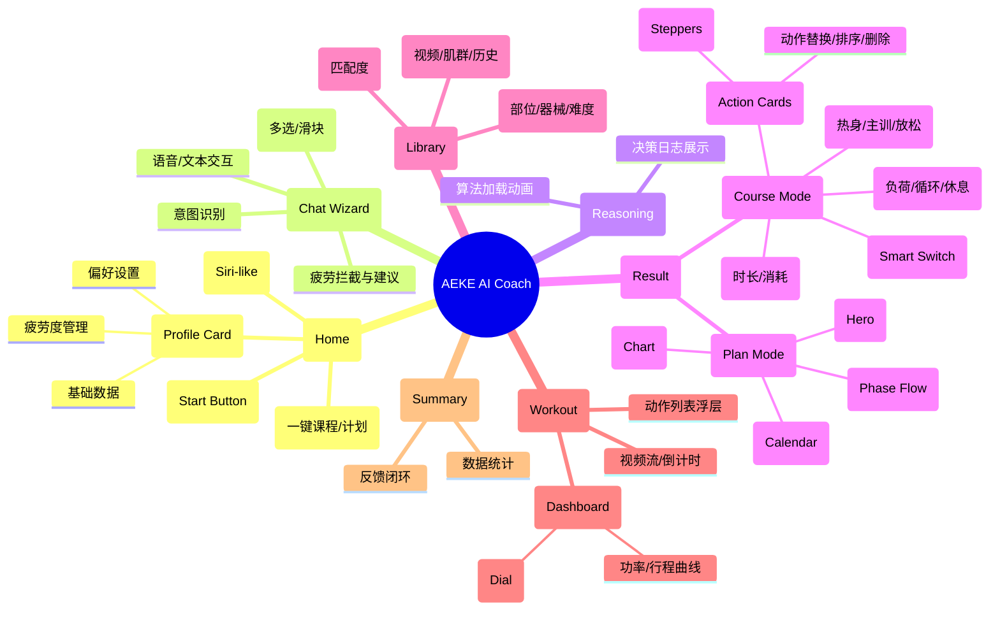

# AI推荐系统产品需求文档 (PRD)

| 文档版本 | V27.0 (Demo Sync) |
| :--- | :--- |
| **文档状态** | 正式发布 |
| **撰写日期** | 2026-01-23 |
| **对应Demo** | AI推荐_智能版 [Demo] (V27.0) |

---

## 1. 产品概述

### 1.1 背景
传统的健身APP推荐往往基于静态模板，缺乏对用户实时状态（如疲劳度）、临时需求（如时间紧迫）及个性化偏好（如动作厌恶）的动态响应。AEKE AI Coach (V27.0) 旨在通过对话式交互和智能算法，提供“千人千面”的实时训练解决方案，并引入“拟人化”的交互体验与“透明化”的决策过程。

### 1.2 产品目标
- **极致个性化**：基于用户档案、疲劳状态和即时需求，生成秒级响应的定制课程或计划。
- **交互拟人化**：通过语音/文本对话形式，模拟真人教练的问询与决策过程，配合 Siri-like 动效提供情感化反馈。
- **过程透明化**：展示AI推理过程（Reasoning View），增强用户对推荐结果的信任。
- **高度可控性**：提供专业级的微调编辑器，支持“智能托管”与“专家微调”双模式切换。

### 1.3 目标用户
- **初级用户**：不知道练什么，依赖 AI 全托管推荐，只需简单对话即可开始。
- **进阶用户**：有明确目标，需要 AI 辅助生成框架，并支持手动微调负荷、组数、动作顺序等细节。

---

## 2. 功能架构图

---

## 3. 功能需求详情 (Function Specs)

### 3.1 模块一：AI 助手与首页

#### 3.1.1 虚拟形象与状态
- **Siri-like 动效**：首页常驻 AI 虚拟形象（光球/轨道），具备以下状态：
    - **待机**：缓慢呼吸律动。
    - **聆听中**：光球扩散，轨道加速，反馈麦克风收音状态。
    - **思考中**：颜色变换（如变蓝），高频闪烁。
    - **表达中**：波形律动，配合 TTS 语音输出。

#### 3.1.2 语音/多模态交互
- **唤醒机制**：支持点击麦克风图标或特定语音指令唤醒。
- **意图识别**：
    - **快捷指令**：识别“给我一节课”、“制定计划”等关键词直接进入对应流程。
    - **参数提取**：从自然语言中提取关键参数（如“练胸”、“30分钟”、“周一三五”）。
    - **模糊匹配**：支持非标准表述（如“练大腿”映射为“腿部”）。
- **实时字幕**：用户说话时，屏幕实时显示识别到的文本字幕。

#### 3.1.3 快捷入口
- **一键生成**：提供“给我一节课”和“给我一份计划”两个高频入口。
- **档案概览**：底部卡片展示用户核心画像（目标、等级、体重、疲劳度），支持点击展开编辑。
- **启动触发**：
    - **UI状态**：中心化展示麦克风图标、引导文案“点击开启麦克风权限”及当前版本号 (V27.0)。
    - **交互逻辑**：点击按钮后，系统需请求浏览器麦克风权限。
    - **状态流转**：权限获取成功后，页面应用 `.state-chat` 样式类，Siri 动效球体缩小并上移至顶部，底部弹出对话输入区，视图切换至 `view-chat`。

---

### 3.2 模块二：运动档案与疲劳管理

#### 3.2.1 档案管理
- **基础数据**：性别、生日（自动计算年龄/最大心率）、身高、体重（自动计算BMI）、静息心率。
- **训练偏好**：
    - **运动等级**：L1-L5。
    - **时间预算**：每日运动时长。
    - **风控禁忌**：疼痛部位（多选）、缺失器械（多选）。
    - **日程偏好**：每周训练日（如周一、三、五）。
- **目标设定**：主要目标（增肌/减脂/健康）、功能目标（力量/耐力/心肺等）、目标体型/体重。

#### 3.2.2 疲劳度模型
- **主观评分**：用户输入 1-10 分的主观疲劳度。
- **状态映射**：
    - **1-2 分**：定义为“超量恢复”，系统推荐策略偏向“冲击PR/大重量”。
    - **3-4 分**：定义为“完全恢复”，系统推荐策略为“常规高容量”。
    - **5-6 分**：定义为“功能性疲劳”，系统推荐策略为“中等强度”。
    - **7-8 分**：定义为“非功能性疲劳”，系统推荐策略为“减载/主动恢复”。
    - **9-10 分**：定义为“过度训练”，系统应强制建议“完全休息”。
- **风控干预规则**：当用户在生成课程时选择了处于“疲劳中”或“已力竭”状态的部位（基于疲劳算法计算），系统必须在对话流中弹出拦截提示，建议用户切换至“已恢复”部位或接受“难度降级”（强度系数下调至 0.8）。

---

### 3.3 模块三：对话式生成向导

#### 3.3.1 课程生成流程
- **步骤1：类型选择**
    - 询问：“想练点什么？”
    - 选项：力量、HIIT、有氧、瑜伽、普拉提等。
- **步骤2：部位/目标选择**
    - 询问：“重点想练哪个部位？”
    - 选项：全身、胸部、背部、腿部等（支持多选）。
    - **疲劳拦截**：若选中疲劳部位，弹出警告并推荐替代方案。
- **步骤3：时长设定**
    - 询问：“今天有多少时间？”
    - 交互：滑块选择（20-90分钟）。

#### 3.3.2 计划生成流程
- **步骤1：周期设定**
    - 询问：“计划持续多久？”
    - 交互：滑块选择（1-24周）。
- **步骤2：日程安排**
    - 询问：“每周哪几天训练？”
    - 交互：星期多选芯片（支持语音“周末不练”、“只练工作日”等复杂指令）。
- **步骤3：单课时长**
    - 询问：“每天平均训练多久？”

#### 3.3.3 推理展示
- 在生成结果前，展示 AI 的决策日志，提升即视感：
    1. 读取档案（分析用户画像）。
    2. 解析需求（意图与参数）。
    3. 风控扫描（避开伤病/疲劳部位）。
    4. 策略匹配（加载训练范式与负荷策略）。
    5. 构建课程（动作筛选与排编）。

---

### 3.4 模块四：结果页与编辑器

#### 3.4.1 课程结果页
- **头部信息**：课程标题、副标题（时长/部位/等级）、单位切换（KG/LBS）。
- **统计栏**：
    - **预计时长**：所有动作（单组耗时+休息时间）的总和，单位分钟。
    - **动作数量**：当前课程包含的动作总数。
    - **总容量**：所有动作的组数之和。
    - **预估消耗**：公式 `0.075 * 体重(kg) * 总时长(min)`，单位 kcal。
- **环节导航**：顶部吸附式 Tab。点击 Tab 时，下方列表仅渲染对应环节（热身/主训/放松）的动作卡片。默认选中“主训”环节（若存在）。
- **环节控制栏**：
    - **智能推荐**：全局开关，默认开启。
        - **开启状态**：AI 接管所有策略参数。策略下拉框（负荷/循环）与休息时间输入框（组间/轮间）处于禁用状态（Disabled）。用户点击这些区域时，系统需弹出 Toast 提示：“请关闭智能推荐自定义编辑”。
        - **关闭状态**：解除禁用，允许用户手动修改策略参数。
    - **策略参数**：
        - **负荷策略**：下拉选择 [恒定, 递增, 递减, 计时]。
            - **变更规则**：修改此选项后，系统需立即重新计算当前环节所有动作的组详情（重量/次数）。例如从“恒定”切为“递增”，动作的组序列应变为金字塔结构（如 85% -> 90% -> 100%）。
        - **循环模式**：下拉选择 常规组 / 循环组 / 超级组。
        - **休息时间**：数字输入框，支持修改 组间休息(s) 和 轮间休息(s)。
- **动作列表**：展示当前选中环节的动作卡片流，底部提供“+ 添加动作”入口。

#### 3.4.2 专业动作卡片
- **折叠态**：展示动作缩略图、名称、部位/肌肉标签、摘要（如 "4组 x 12次 20kg"）。
    - **工具栏**：上移（首个禁用）、下移（末尾禁用）、替换（点击打开动作库）、展开/折叠。
    - **删除**：卡片右上角提供删除按钮（需二次确认）。
- **展开态**：
    - **组详情列表**：每一组的 序号、步进器控制区、删除按钮。
    - **步进器交互**：
        - **重量调整**：点击 +/- 按钮。若单位为 KG，步长为 0.5kg；若单位为 LBS，步长为 1lbs。
        - **次数/时长调整**：点击 +/- 按钮。若为计次动作，步长为 1次；若为计时动作，步长为 5s。
        - **状态限制**：若“智能推荐”开关为开启状态，步进器应置灰且不可点击。点击时触发 Toast 提示。
    - **智能策略联动**：
        - **触发条件**：仅在“智能推荐”关闭且用户手动修改了某一组的重量时触发。
        - **判定逻辑**：系统对比第一组重量 (W_first) 与最后一组重量 (W_last)。
            - 若 W_first < W_last，判定为“递增”。
            - 若 W_first > W_last，判定为“递减”。
            - 若 W_first == W_last，判定为“恒定”。
        - **执行动作**：若判定出的策略与当前下拉框选中的策略不一致，系统应自动更新下拉框的值，并弹出 Toast 提示“策略已自动切换为: [新策略]”。
        - **中间组插值**：当策略判定为“递增”或“递减”时，系统自动对中间组的重量进行**线性插值**计算，确保重量变化平滑过渡。公式：`当前组重量 = 首组重量 + (末组重量 - 首组重量) * (当前索引 / 总组数 - 1)`。
    - **参数联动规则**：
        - **负荷优先模式**（抗阻主训）：
            - **修改重量**：系统自动基于用户 1RM 和新重量反推并更新 **次数**（Reps）。计算公式：`新次数 = 查表(新重量 / 1RM)`。
            - **修改次数**：**不**反向更新重量（允许用户在固定重量下微调容量）。
        - **容量优先模式**（间歇/流式）：
            - **修改时长/次数**：**不**影响重量参数。
            - **修改重量**：**不**影响时长/次数参数。
    - **编辑功能**：
        - **删除组**：点击组右侧的 X 按钮删除该组。若仅剩 1 组，则不允许删除。
        - **添加组**：点击底部“+ 加一组”按钮，复制最后一组的数据作为新组添加。
    - **底部信息**：显示强度百分比（%1RM）、RPE、组间休息时间。
    - **详情入口**：底部链接“查看动作详情 >”，点击打开动作详情模态框。

#### 3.4.3 计划结果页
- **头部概览**：沉浸式展示计划标题、核心标签（等级/周期/频率）、适应人群与痛点介绍。
- **体重预测图表**：
    - **绘制逻辑**：使用 SVG 绘制折线。起点为当前体重，终点为目标体重。
    - **阶段权重插值**：中间节点并非线性均分，而是根据阶段类型赋予不同权重。例如“突破期”权重高（变化大），“适应期”权重低（变化小）。权重参考：适应(0.1), 进阶(0.3), 增长(0.3), 突破(0.4), 减载(0.05)。
    - **联动交互**：
        - 当用户点击下方的“阶段流程 Tab”时，图表应高亮显示该阶段对应的时间段。
        - **高亮样式**：该阶段起止点之间的连线变为高亮色（如绿色），终点圆点半径放大（如 r=3），数值字体放大且颜色变亮。非选中阶段的线条和点保持暗色。
- **阶段流程**：顶部采用 Tab 形式展示各阶段（适应/进阶等），显示周数与强度系数。点击 Tab 切换下方日程。
- **日程日历**：
    - **周视图**：展示当前选中阶段的每日安排（周一至周日）。
    - **训练日卡片**：
        - **标题生成规则**：`{部位名称}{阶段后缀}`。
            - 阶段后缀映射：适应期="激活", 进阶/增长期="增长", 突破期="突破", 减载/恢复期="恢复"。
            - 示例：适应期的胸部训练显示为 "胸部激活"。
        - **副标题**：显示用户当前等级（如 L3）。
    - **下钻交互**：点击训练日卡片，界面应平滑过渡至“课程结果页”视图。
        - **导航栏变化**：课程页左上角显示“← 返回计划”按钮，点击后返回计划页；隐藏原本的“关闭”按钮。
        - **数据加载**：根据该训练日的设定（部位/时长/目标）实时生成当天的详细课程数据。
    - **休息日卡片**：显示“休息”字样，置灰，不可点击。
- **加入日程**：确认后将计划写入用户日历。

---

### 3.5 模块五：动作库与筛选

#### 3.5.1 筛选器
- **部位筛选**：横向滚动标签栏，支持按部位（全身/胸/背/腿等）快速过滤动作列表。
- **智能排序**：列表加载时，需根据匹配度（Match Score）降序排列。优先展示符合当前课程目标、拥有对应器械、且近期未训练（新鲜度高）的动作。已选中的动作应在列表中高亮显示。

#### 3.5.2 动作列表
- 展示动作名称、部位、器械要求、难度等级。
- 选中动作后，返回编辑器替换原动作，并自动重新计算负荷参数。

#### 3.5.3 动作详情页
- **模态框结构**：全屏或半屏模态框，包含头部标题、关闭按钮、内容区域。
- **多维展示**：
    - **简介 Tab**：展示动作演示视频（自动循环播放）、肌群映射图（SVG高亮主动肌区域）、基本属性标签（器械/难度）。
    - **教学 Tab**：动作要点文本。
    - **历史 Tab**：展示该动作的历史 1RM 趋势折线图及最近 5 次训练记录。

---

## 4. 核心算法逻辑

### 4.1 课程生成逻辑
1.  **上下文构建**：合并用户档案、输入参数、疲劳状态。
2.  **环节规划**：
    - **时长切分**：热身占比 15% (上限5min)，放松占比 15% (上限5min)，剩余时间分配给主训。
    - **时间-容量自适应**：
        - **触发条件**：若课程总时长 ≤ 30分钟。
        - **休息压缩**：根据目标强制压缩组间休息时间上限：力量/爆发 ≤ 120s，增肌/塑形 ≤ 60s，减脂/心肺 ≤ 45s。
        - **组数降级**：若计算出的主训动作数量 < 3 个，且基准组数 > 2，则强制将动作组数下调（最低 2 组），以换取能够容纳更多的动作数量（多样性优先）。
3.  **动作筛选**：
    - **硬过滤**：
        - 剔除 `动作.疼痛部位` 与 `用户.疼痛部位` 有交集的动作。
        - 剔除 `动作.所需器械` 不在 `用户.拥有器械` 列表中的动作。
        - 若用户处于疲劳状态且未接受降级，剔除 `冲击等级` 为“高冲击”的动作。
    - **软打分**：
        - **新鲜度奖励**：若 (当前时间 - 上次训练时间) > 7天，加 60 分。
        - **收藏奖励**：若动作为用户收藏，加 50 分。
        - **难度匹配**：若动作难度与目标难度一致，加 30 分。
        - **厌恶惩罚**：若动作为用户近期移除过，扣 80 分。
        - **随机扰动**：最终得分增加一个 0-15 分的随机值，防止排序固化。
    - **Top-K 随机策略**：在填充槽位时，不总是选择得分第 1 的动作，而是从得分前 3 名中随机抽取 1 个。
    - **缺口填充**：
        - **触发条件**：当筛选出的动作总时长 < 环节目标时长。
        - **执行逻辑**：循环遍历已选动作列表，依次增加 1 组，直到总时长达标。
        - **熔断机制**：单个动作的最大组数不得超过 6 组。若达到上限仍有时长缺口，则停止填充。
4.  **参数实例化**：
    - **负荷优先模式**（适用于抗阻范式）：
        - **重量计算**：`推荐重量 = 用户1RM * 强度系数`。若无 1RM 数据，使用 `默认重量 * 系数` 兜底。
        - **次数计算**：根据强度系数查表反推目标次数（如 75% 1RM 对应 10 次）。
    - **容量优先模式**（适用于间歇/流式范式）：优先确定时长或次数，重量设为 0 或适配值。
    - **组间策略**：根据 `负荷策略` 生成每组数据。
        - **递增**：第一组负荷系数 0.85，第二组 0.90，第三组及以后 1.0。
        - **恒定**：所有组负荷系数 1.0。
5.  **命名与封装**：
    - **课程标题**：
        - **单课模式**：`{课程类型}训练`（如：力量训练、HIIT训练）。
        - **计划模式**：`W{周数} | {训练日名称}`（如：W1 | 胸部训练）。
    - **副标题**：`{时长}min | {核心部位} | {难度等级}`。

### 4.2 计划生成逻辑
1.  **模板匹配**：
    - 系统遍历所有单周循环模板，计算匹配分值。
    - **匹配规则**：优先匹配 `目标` 一致、`难度` 适配、且 `模板周频` ≤ `用户周频` 的模板。
    - **性别区分**：若存在性别特定的模板（如“臀腿侧重”针对女性），优先匹配对应性别的模板。
2.  **周期规划**：
    - **短周期 (<4周)**：采用压缩模型，仅包含 [进阶期, 突破期]。
    - **标准周期 (≥4周)**：采用完整模型，按顺序生成 [适应期 -> 进阶期 -> 突破期 -> 减载期]。
3.  **日程填充**：
    - 将选定模板的 `基础槽位` 按顺序映射到用户的 `每周训练日`。
    - 若用户训练频率 > 模板频率，使用 `补充槽位` 或循环 `基础槽位` 进行填充。
4.  **命名与封装**：
    - **计划标题**：`{等级中文}{功能目标}计划`（如：中级增肌计划、初级减脂计划）。
        - 等级映射：L1/L2=初级，L3/L4=中级，L5=高级。
    - **阶段名称**：
        - 标准周期：适应期 -> 进阶期 -> 突破期 -> 减载期。
        - 短周期：进阶期 -> 突破期。

---

## 5. 非功能需求

### 5.1 性能要求
- **生成速度**：单次课程生成耗时 < 1秒（前端计算）。
- **语音响应**：语音识别上屏延迟 < 200ms。

### 5.2 交互体验
- **容错性**：语音输入支持模糊匹配（如“练胸肌”=“胸部”）。
- **反馈**：所有关键操作（生成、保存、修改）需有 Toast 或 语音反馈。
- **动画**：视图切换需有平滑过渡，AI 思考需有动效支撑。

### 5.3 离线能力
- 系统应内置基础动作库（Fallback Data），确保在无网络环境下仍能生成基础课程。

---

## 6. 数据埋点需求

| 事件ID | 事件名称 | 关键参数 |
| :--- | :--- | :--- |
| `flow_start` | 开始流程 | `type` (course/plan), `source` (voice/click) |
| `voice_input` | 语音输入 | `text` (识别文本), `step` (当前步骤) |
| `course_generated` | 课程生成成功 | `duration`, `targets`, `action_count` |
| `plan_generated` | 计划生成成功 | `cycle`, `freq`, `template_id` |
| `action_replace` | 动作替换 | `original_id`, `new_id` |
| `param_edit` | 参数微调 | `field` (weight/reps/sets) |
| `start_training` | 开始训练 | `course_id` |