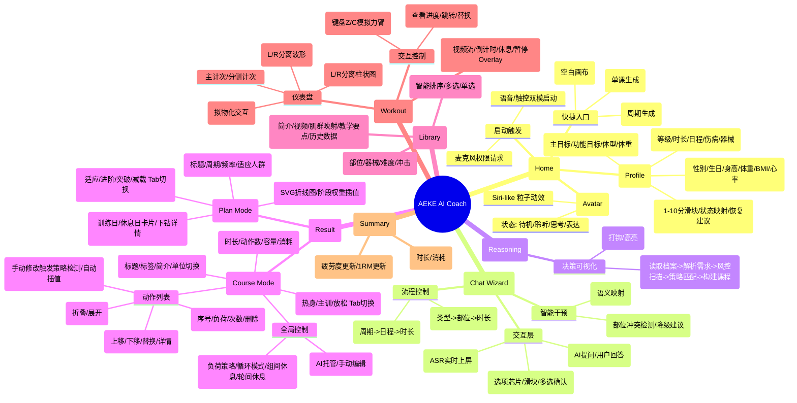
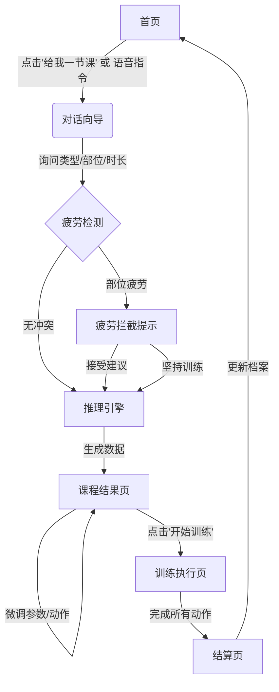
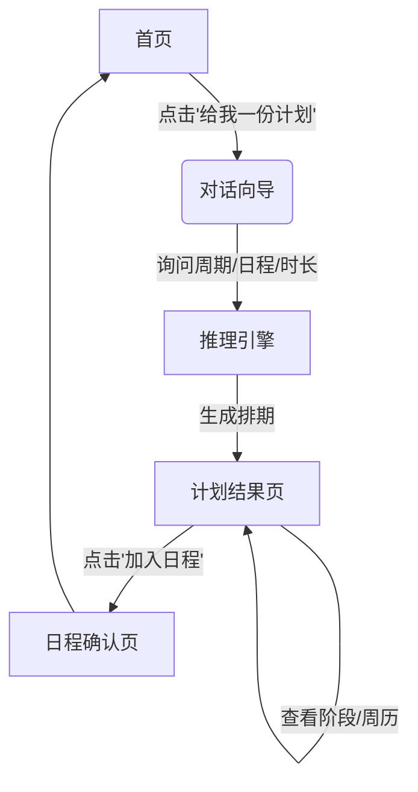

# AI推荐系统产品需求文档 (PRD)

| 文档版本 | V27.0 |
| :--- | :--- |
| **文档状态** | 正式发布 |
| **撰写日期** | 2026-01-24 |
| **对应Demo** | AI推荐_智能版 [Demo] (V27.0) |

---

## 1. 产品概述

### 1.1 背景
传统的健身APP推荐往往基于静态模板，缺乏对用户实时状态（如疲劳度）、临时需求（如时间紧迫）及个性化偏好（如动作厌恶）的动态响应。AEKE AI Coach (V27.0) 旨在通过对话式交互和智能算法，提供“千人千面”的实时训练解决方案，并引入“拟人化”的交互体验与“透明化”的决策过程。系统集成了运动科学模型（疲劳管理、周期化训练）与AI决策引擎，实现从宏观计划到微观动作参数的全链路智能生成。

### 1.2 产品目标
- **极致个性化**：基于用户档案、疲劳状态和即时需求，生成秒级响应的定制课程或计划，支持“单课”与“周期计划”双模式。
- **交互拟人化**：通过语音/文本对话形式，模拟真人教练的问询与决策过程，配合 Siri-like 动效提供情感化反馈，降低决策门槛。
- **过程透明化**：展示AI推理过程，将黑盒算法可视化，增强用户对推荐结果的信任。
- **高度可控性**：提供专业级的微调编辑器，支持“智能托管”与“专家微调”双模式切换，满足不同层级用户需求。
- **科学闭环**：内置疲劳管理、能力成长模型与周期化训练逻辑，确保训练的安全性和有效性。

### 1.3 目标用户
- **初级用户 (L1-L2)**：不知道练什么，依赖 AI 全托管推荐，只需简单对话即可开始，重视安全与引导。
- **进阶用户 (L3-L5)**：有明确目标，需要 AI 辅助生成框架，并支持手动微调负荷、组数、动作顺序等细节，重视效率与科学性。

---

## 2. 功能架构图

---

## 3. 业务流程图

### 3.1 主线流程：单课生成与执行

### 3.2 分支流程：计划生成

---

## 4. 页面详细说明

### 4.1 首页 (View-Home)

#### 4.1.1 功能释义
产品的入口，展示AI形象、快捷入口及用户核心档案。

#### 4.1.2 核心元素
- **虚拟形象 (Siri-like)**：
  - 位于屏幕上方，常驻呼吸动效。
  - 状态映射：待机（呼吸）、聆听（扩散）、思考（闪烁）、表达（波形）。
- **启动按钮**：
  - 中心化大按钮，图标为麦克风。
  - 点击触发浏览器麦克风权限请求，成功后进入对话模式。
- **快捷入口**：
  - “给我一节课”：直接进入单课生成对话流。
  - “给我一份计划”：直接进入计划生成对话流。
  - “自定义课程模板”：进入空白课程编辑器。
- **运动档案卡片**：
  - 底部半屏卡片，展示：主要目标、运动等级、体重、主观疲劳度。
  - 点击“更新”按钮弹出档案编辑模态框。

#### 4.1.3 交互说明
- **语音唤醒**：支持点击麦克风或直接语音指令（需权限）。
- **档案编辑**：点击编辑按钮，弹出 `modal-profile`，支持 Tab 切换（基础/偏好/目标）。
  - **疲劳度滑块**：1-10分，滑动时实时改变颜色（绿->黄->红）及文案（超量恢复->过度训练）。

---

### 4.2 对话向导 (View-Chat)

#### 4.2.1 功能释义
模拟真人教练的问询过程，通过多轮对话收集生成所需的约束条件。

#### 4.2.2 数据定义
- **输入流 (Inputs)**：存储用户回答的键值对（如 `{type: '力量', targets: ['胸部'], duration: 30}`）。
- **步骤控制 (Step)**：当前对话进行的步骤索引。

#### 4.2.3 交互说明
- **提问机制**：AI 气泡显示问题，配合 TTS 语音播报。
- **回答机制**：
  - **语音**：按住/点击麦克风说话，实时转文字上屏。支持模糊匹配（如“练大腿”->“腿部”）。
  - **选项芯片**：点击屏幕上的 Tag 直接选择。
  - **滑块**：针对时长/周期等数值型问题，提供滑块控件。
- **疲劳拦截**：
  - 若用户选择的部位处于疲劳状态（档案中记录），AI 暂停流程，弹出警告气泡：“检测到[部位]尚未恢复，建议切换为[推荐部位]”。
  - 提供选项：“切换”、“坚持训练”。

---

### 4.3 推理引擎 (View-Reasoning)

#### 4.3.1 功能释义
在对话结束与结果展示之间，展示 AI 的计算过程，消除“黑盒”感，建立信任。

#### 4.3.2 交互说明
- **日志滚动**：屏幕中央依次弹出计算步骤日志。
  - 读取档案...
  - 解析需求...
  - 风控扫描...
  - 策略匹配...
  - 构建课程...
- **视觉反馈**：每条日志前有 Loading 动画，完成后变为打钩图标。
- **自动跳转**：所有步骤完成后，自动跳转至结果页。

---

### 4.4 课程结果页 (View-Result / Course Mode)

#### 4.4.1 功能释义
展示生成的单节课程详情，提供“智能托管”与“专家微调”两种模式。

#### 4.4.2 核心区域
- **头部**：课程标题、标签（等级/时长/部位）、简介。
- **统计栏**：总时长、动作数、总容量（组数）、预估消耗 (kcal)。
- **环节导航**：吸附式 Tab（热身 / 主训 / 放松）。
- **控制栏 (Fine-Tuning)**：
  - **智能推荐开关**：
    - **ON (默认)**：AI 接管策略。负荷策略、循环模式、休息时间等控件置灰禁用。
    - **OFF**：用户可手动修改策略参数。
  - **策略参数**：
    - **负荷策略**：恒定 / 递增 / 递减 / 计时。修改后触发全环节动作参数重算。
    - **循环模式**：常规组 / 循环组 / 超级组。
    - **休息时间**：组间休息 / 轮间休息。
- **动作列表**：
  - **卡片折叠态**：缩略图、名称、部位、摘要（如 "4组 x 12次 20kg"）。
  - **卡片展开态**：
    - **组详情**：每一组的序号、重量/次数步进器、删除按钮。
    - **步进器**：支持 +/- 微调。若智能推荐开启，点击步进器提示“请先关闭智能推荐”。
    - **添加组**：复制最后一组配置。
    - **工具栏**：上移、下移、替换（打开动作库）、详情。

#### 4.4.3 智能联动逻辑
- **策略自动检测**：当智能推荐关闭时，若用户手动修改了第一组和最后一组的重量，系统自动判定策略（如首<尾则为递增），并自动对中间组进行**线性插值**计算，更新下拉框状态。
- **负荷反推**：修改重量时，基于 1RM 自动反推建议次数（Reps）。

---

### 4.5 计划结果页 (View-Result / Plan Mode)

#### 4.5.1 功能释义
展示生成的长周期计划，包含阶段划分、体重预测及每日安排。

#### 4.5.2 核心区域
- **计划概览**：标题、周期、频率、适应人群。
- **体重预测图**：
  - SVG 折线图，展示从当前体重到目标体重的变化趋势。
  - **阶段高亮**：点击下方阶段 Tab 时，图表中对应的时间段线条高亮显示。
- **阶段流程**：
  - Tab 形式展示：适应期 -> 进阶期 -> 突破期 -> 减载期。
  - 显示每个阶段的周数和强度系数。
- **周历视图**：
  - 展示选中阶段的典型周安排（周一至周日）。
  - **训练日卡片**：显示部位和阶段后缀（如“胸部激活”）。点击下钻至课程详情页。
  - **休息日卡片**：置灰显示。

---

### 4.6 动作库 (View-Library)

#### 4.6.1 功能释义
动作的查询与选择中心，支持多维筛选。

#### 4.6.2 交互说明
- **筛选器**：部位（胸/背/腿...）、器械、难度、冲击等级。
- **列表排序**：默认按“匹配度”降序。匹配度算法考虑：新鲜度（久未练）、收藏状态、难度匹配度。
- **选择模式**：
  - **替换模式**：单选，选中后直接返回结果页替换原动作。
  - **添加模式**：多选，选中后批量添加到当前环节末尾。
- **动作详情**：点击列表项非选框区域，弹出详情模态框（视频、肌群图、历史数据）。

---

### 4.7 训练执行 (View-Workout)

#### 4.7.1 功能释义
用户跟随训练的执行界面，集成视频流与实时数据反馈。

#### 4.7.2 核心元素
- **主视觉区**：
  - 动作演示视频 / 直播流占位。
  - **Overlay**：倒计时（3-2-1）、休息倒计时、暂停遮罩。
  - **顶部信息**：当前环节、动作名称、组数进度。
- **仪表盘 (Dashboard)**：
  - **功率图**：左右分立的柱状图，实时显示 L/R 功率输出。
  - **行程图**：波形图显示动作行程。
  - **重量旋钮**：拟物化旋钮（SVG），支持拖拽调节重量（模拟电机阻力调节）。
  - **主计数器**：大字号显示当前次数/倒计时。
- **控制区**：
  - **动作列表浮层**：点击标题栏展开，查看完整动作序列，支持跳转或替换。
  - **模拟控制**：(Demo专用) 键盘 Z/C 键模拟左右力臂拉动，X 键加速时间。

#### 4.7.3 异常状态
- **暂停**：点击屏幕或暂停按钮，弹出暂停遮罩，提供“继续”和“结束”选项。
- **结束确认**：点击结束时需二次确认，防止误触。

---

### 4.8 结算页 (View-Summary)

#### 4.8.1 功能释义
训练结束后的数据汇总与反馈。

#### 4.8.2 内容
- **核心指标**：总时长、总消耗 (kcal)、综合得分。
- **反馈闭环**：
  - 更新用户疲劳度（累加）。
  - 更新动作 1RM 数据（基于本次训练最大负荷）。
- **操作**：点击“完成”返回首页。

---

## 5. 附录：数据字典简表

| 字段 | 类型 | 说明 |
| :--- | :--- | :--- |
| `user.fatigue` | Int (1-10) | 主观疲劳度，影响风控 |
| `user.level` | Enum (L1-L5) | 运动等级，影响强度系数 |
| `action.paradigm` | Enum | 训练范式：抗阻/间歇/流式 |
| `phase.strategy` | Object | 环节策略：含 rest, sets, intensity 等 |
| `course.meta` | Object | 课程元数据：类型, 目标, 时长 |