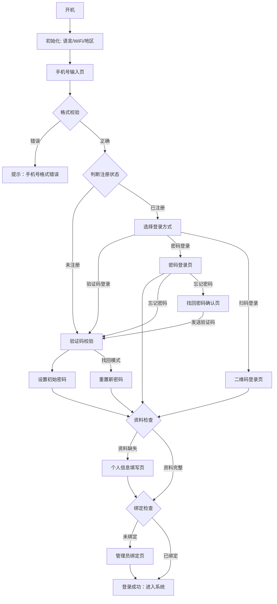

# AEKE Fit 手机号注册登录产品需求文档 (设备端 - 国内版)

| 版本 | 日期 | 状态 | 修改人 | 备注 |
| :--- | :--- | :--- | :--- | :--- |
| v12.3 | 2024-05-24 | 草案 | 智能产品经理 | 新增初始化流程及找回密码确认页，标注已有页面 |

## 1. 产品概述
### 1.1 背景
AEKE Fit 正在推进海外版软件向国内市场的迁移。鉴于海外版本目前仅支持邮箱登录，无法完全满足国内用户以手机号为核心的使用习惯。本次升级旨在引入更符合国情的手机号注册登录逻辑，在确保与现有流程平滑兼容的前提下，构建稳健、高效的本土化账号体系。
### 1.2 目标
*   **本土化适配**：建立以手机号为核心的准入机制，降低国内用户注册门槛，提升转化率。
*   **极致交互体验**：针对健身镜大屏及站立使用场景进行深度优化，确保操作路径最短、视觉反馈最清晰。
*   **业务逻辑闭环**：在登录环节无缝集成设备管理员绑定与个人画像初始化，确保后续 AI 运动方案的精准性与设备安全性。
*   **系统平滑兼容**：确保手机号登录逻辑与原有邮箱体系的逻辑兼容，保障迁移过程中的数据一致性与用户体验连贯性。

## 2. 业务流程与逻辑判断
### 2.1 核心逻辑分支
1.  **初始化设置**：设备首次启动或重置后，需依次完成【选择语言】、【连接 WiFi】及【选择地区】。
2.  **手机号分流**：输入手机号后，系统判断用户是否注册。
    *   若账号已注册：用户可选择使用验证码快捷登录，或切换至密码登录模式。
    *   若账号未注册：系统引导用户完成验证码校验，随后进入设置初始密码流程。
3.  **找回密码**：属于独立业务路径。
    *   用户在密码登录页点击“忘记密码”，进入【找回密码确认页】。
    *   确认手机号后发送验证码，校验通过后强制引导至重置密码页面。
4.  **新手引导拦截**：用户成功登录或注册后，系统将按顺序执行以下逻辑检查：
    *   第一步：检查用户个人资料是否完整。若缺失，则拦截并引导至个人信息填写页面。
    *   第二步：检查当前设备是否已绑定管理员。若未绑定，则拦截并引导至管理员绑定页面。

### 2.2 功能架构清单
*   **账号准入**：手机号输入、格式合法性检查、用户协议与隐私政策确认。
*   **身份验证**：短信验证码获取、60秒倒计时、验证码自动提交校验。
*   **密码管理**：密码登录、新用户密码初始化、忘记密码重置、密码复杂度实时检查。
*   **扫码登录**：二维码生成、App扫码联动、二维码过期自动失效与手动刷新。
*   **引导拦截**：个人画像资料补全引导、设备管理员确权绑定引导。
*   **反馈体系**：顶部系统反馈提示、输入框下方即时错误校验。

### 2.3 业务流程图

### 2.4 详细跳转与判断逻辑描述

1.  **手机号分流点**：
    *   用户点击“获取验证码”后，系统后台自动识别。若是新手机号，验证通过后强制跳转【设置密码】；若是老手机号，验证通过后直接进入【引导检查】。
2.  **验证码自动流转**：
    *   用户无需点击确认，填满6位数字后系统自动校验。校验成功则根据用户身份（新/老/找回密码）跳转至下一页；校验失败则清空输入并提示。
3.  **找回密码回溯**：
    *   在密码登录页点击“忘记密码”，系统会记录“重置模式”，用户通过验证码核验身份后，跳转至【重置密码】而非首页。
4.  **扫码登录闭环**：
    *   用户在设备端打开二维码，使用手机 App 扫码并确认。设备端感应到状态变更后，自动跳过账号密码输入，直接进入【引导检查】。
5.  **引导拦截优先级**：
    *   **优先级1（个人资料）**：系统首先看用户是谁，如果没填身高体重，必须先填资料。
    *   **优先级2（管理员）**：资料填完后，系统看设备是谁的，如果没有管理员，引导当前用户绑定。
    *   **终点**：只有以上两项都满足，用户才能看到“登录成功”并进入主界面。

## 3. 页面详细功能说明

### 3.1 手机号输入页
*   **页面目标**：收集用户手机号并进行初步格式校验，作为进入后续流程的唯一标识。
*   **页面组成**：品牌标识（Logo）、手机号输入框、主操作按钮（获取验证码）、辅助入口（密码登录、二维码登录）、法律协议区。
*   **交互与逻辑**：
    *   **输入限制**：仅限数字输入，最大长度 11 位。
    *   **即时反馈**：当输入满 11 位且符合国内手机号段规则（1xx）时，输入框右侧显示绿色勾选图标。
    *   **按钮状态**：初始状态按钮禁用；仅当手机号输入满 11 位时激活。
    *   **分流逻辑**：点击“获取验证码”后，系统需判断用户注册状态。新用户流向验证码校验 -> 设置密码；老用户流向验证码校验 -> 引导流程。
*   **异常处理**：
    *   格式错误：点击按钮时，若不符合 11 位数字规则，输入框下方显示红色提示“手机号格式错误”。
    *   网络异常：点击后进入加载状态，若超时则弹出系统提示。
    *   **频次限制**：若短时间内频繁获取验证码，Toast 提示“请求过于频繁，请稍后再试”。
*   **出口**：验证码校验页、密码登录页、二维码登录页。

### 3.2 验证码校验页
*   **页面目标**：通过短信验证码确认用户对手机号的所有权。
*   **页面组成**：标题、手机号脱敏展示（如 137****0000）、6 位独立数字输入框、倒计时/重发按钮。
*   **交互与逻辑**：
    *   **自动聚焦**：进入页面后自动聚焦首位输入框。
    *   **流转逻辑**：每输入一位数字，光标自动跳转至下一位；删除数字时，光标自动回退至上一位。
    *   **自动提交**：当第 6 位验证码输入完成后，系统立即发起后台校验，无需用户点击。
    *   **倒计时逻辑**：进入页面自动开始 60 秒倒计时。倒计时内按钮禁用并显示剩余秒数；倒计时结束后文案变为“重新发送”并恢复点击。
*   **异常处理**：
    *   验证码错误：校验失败时，清空所有输入框，弹出提示“验证码错误”，并重新聚焦首位。
    *   **网络异常**：自动提交校验时若网络超时，Toast 提示“网络连接异常，请重试”。
*   **出口**：设置密码页（新用户/重置流）、引导流程（老用户）。

### 3.3 密码登录页
*   **页面目标**：允许已注册用户通过预设密码快速登录。
*   **页面组成**：标题、账号显示区（只读）、密码输入框（带显隐切换）、登录按钮、辅助入口（二维码登录、忘记密码）。
*   **交互与逻辑**：
    *   **密码显隐**：点击末端眼睛图标，切换密码明文/密文状态。
    *   **忘记密码**：点击后标记为“重置模式”，跳转至验证码发送流程。
*   **异常处理**：
    *   账号不存在：点击登录，若后端返回用户未注册，输入框下方提示“该手机号未注册”。
    *   密码错误：校验失败提示“账号或密码错误”。
    *   **网络异常**：登录请求超时或失败，Toast 提示“网络连接异常，请重试”。
*   **出口**：引导流程、二维码登录页、验证码校验页（找回密码路径）。

### 3.4 设置与重置密码页
*   **页面目标**：引导用户创建或修改登录密码，确保账号安全。
*   **页面组成**：标题（动态）、描述文案、新密码输入框、确认密码输入框、复杂度规则检查清单、确认按钮。
*   **交互与逻辑**：
    *   **动态文案**：注册场景标题为“设置密码”，按钮为“确认并注册”；找回场景标题为“重置密码”，按钮为“确认重置”。
    *   **强度校验**：实时检测输入内容，下方规则清单（6-20字符、包含字母、包含数字）根据满足情况动态切换选中状态。
    *   **二次确认**：校验两次输入的字符串是否完全一致。
*   **异常处理**：
    *   规则未达标：点击确认时，若未满足复杂度，输入框下方逐行显示未通过的规则提示。
    *   不一致：确认密码框下方提示“两次密码不一致”。
    *   **提交失败**：注册或重置请求因系统原因失败，Toast 提示“系统繁忙，请稍后再试”。
*   **出口**：引导流程。

### 3.5 二维码登录页
*   **页面目标**：利用移动端已登录状态实现设备端快速登录。
*   **页面组成**：二维码展示区、状态提示文案、下载引导按钮。
*   **交互与逻辑**：
    *   **轮询机制**：页面加载后自动请求二维码并开启后台状态轮询。
    *   **状态切换**：
        *   待扫码：展示原始二维码。
        *   已扫码：二维码区域显示加载动画，提示“扫码成功，正在登录”。
        *   已过期：二维码区域覆盖遮罩，提示“二维码已过期”，点击可刷新。
*   **出口**：引导流程。

## 4. 非功能性需求
*   **安全性**：所有密码输入环节必须具备脱敏处理机制，防止信息泄露。
*   **逻辑归档**：系统支持生成高清晰度的业务逻辑全景图，以便于产品评审与技术归档。
*   **多语言支持**：健身镜界面内的所有交互文本需支持中英文切换，但后台逻辑标注与流程说明保持中文。

---
*文档由智能助手基于 AEKE Fit 原型版本 12.2 逆向生成。*