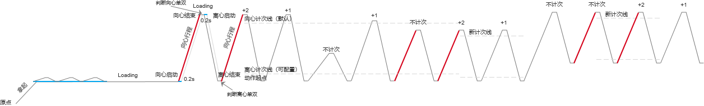

# 背景
这是一个双电机模拟龙门架的智能健身产品，会根据拉动状态自动为用户记录动作次数，作为通用逻辑适用于各种抗阻训练动作

# 核心逻辑
1. 判断是开始做动作而不是静止或抖动（行程超过阈值）
2. 判断是在做单侧还是双侧动作（双侧状态机时间差）
3. 判断用户在做循环动作，而不是乱拉（两次动作行程相似）
4. 判断动作是否可被计次（幅度是否达到标准）
5. 判断用户是否换了动作（行程产生规律变化）

# 逻辑详情
1. 静止判断：
拉动范围 ≤ ±5cm：静止（包含轻微抖动）
拉动范围 ＞ ±5cm：拉动

* 抖动定义：
~~持续 ＞ 300ms，且范围 ±3-5cm。仅用于标记状态，不影响趋势判断与计次~~
**优化逻辑：**
引入 **“行程分级适配策略”** (Stroke Type Adaptation)：
- **超短行程** (提踵): 触发阈值 `> 2.5cm`
- **短行程** (弯举): 触发阈值 `> 4.0cm`
- **中/长行程** (深蹲): 触发阈值 `> 6.0cm`
> **PM Note：** 摒弃“一刀切”的 5cm 阈值。针对不同动作类型应用自适应阈值，彻底解决小幅度动作（如提踵）无法触发、大幅度动作（如深蹲）起势误触发的问题。

2. 趋势判断：
趋势类型：向心/离心/静止
动作静止 ≤ 3s：趋势继续
动作静止 ＞ 3s：趋势改变

3. 单/双侧判断（初始）：
- 初始，基于趋势变化点：
~~向心双侧：向心启动/结束时间差 ≤ 0.2s~~
~~向心单侧：向心启动/结束时间差 ＞ 0.2s~~
**优化逻辑：**
引入“模式锁定”机制：
1. 初始探测期：时间差 ≤ 0.2s 判为双侧。
2. 锁定双侧后：容差放宽至 0.35s（适应疲劳），除非检测到明显的交替动作（时间差 > 0.5s 或 负相关运动）。
> **PM Note：** 人类不是机器，力竭时左右手不同步是常态。0.2s 的死板阈值会导致双侧动作被误判为单侧乱跳，严重干扰训练节奏。

~~离心双侧：离心启动/结束时间差 ≤ 0.2s~~
~~离心单侧：离心启动/结束时间差 ＞ 0.2s~~
**优化逻辑：**
同上，离心阶段同样应用“模式锁定”宽容度。

- 起点/行程初始化后，基于计次线
* 缓冲区（0.15s~0.25s）防止误判

4. 动作初始化：
起点和行程均满足以下条件
- 起点初始化：
~~邻近2次向心起点相似（≤20%）~~
**优化逻辑：**
**冷启动绝对值策略** (Cold Start Strategy)：
- 第一笔动作：直接基于预设绝对阈值判定（如长行程 > 40cm）。
- 后续动作：基准建立后，采用**静止侦测法**（拉力>2kg 且 速度≈0）锁定精确起点。
> **PM Note：** 解决“第一下不计次”的核心。不再傻等两次动作相似，而是结合动作先验知识（如深蹲就是要拉很长）直接判定第一下。
- 行程初始化：
~~邻近2次向心行程相似（≤20%）~~
~~（单侧取单侧，双侧取均值）~~
~~*相似≤20%：相邻两次差值/前一次值 * 100% ≤ 20%~~
**优化逻辑：**
采用**动态平均法**。首个有效动作即建立初步行程基准，后续通过滑动平均不断修正。

行程未确认时：
首次暂停1.5s重置起点和行程
非首次暂停3s重置起点和行程
当初始行程已确认时：
暂停不重置起点和行程
起点容差：± 10cm

1. 计次初始化：
动作初始化未完成：Loading
动作初始化完成：计次+2（补记1次）

1. 计次线：
- 向心计次线：
起点+80%行程
- 离心计次线：
起点+20%行程
行程初始化完成时确认

1. 计次逻辑：（默认向心计次线，动作库支持配置）
- 全局：
~~起点偏差（当前起点与初始起点）＞20%：不计次~~
~~起点偏差≤20%且满足以下条件计次：~~
**优化逻辑：**
**计次触发时机**：
- 从 `行程过线` 调整为 **`顶峰停顿` (Peak)** 瞬间触发。
- 阈值判定：`当前行程` ≥ `计次阈值` (默认 0.8 * 标准行程，且绝对值 > 2.5cm)。
> **PM Note：** 匹配用户心理计数时机（拉到最高点时默念“1”）。同时增加绝对值兜底，防止超短行程动作失效。
- 手柄模式：
向心同时过线（≤0.2s）：双侧计次共+1
向心非同时过线（＞0.2s）：单侧分别计次+1
向心未过线：不计次
- 横杆模式：
向心同时过线（≤0.2s）：计次+1
向心非同时过线：不计次
向心未过线：不计次
* 缓冲区（0.15s~0.25s）防止误判

1. 动作修正：（动作库支持开关此逻辑）
满足以下任意条件，对应的起点/行程同时修正
- 起点修正：
~~最近相邻2次向心起点均偏离当前起点＞20%，且互相相似（≤20%）~~
**优化逻辑：**
最近相邻2次向心起点均偏离当前起点 ＞ 10cm（绝对值），且互相相似（绝对值偏差 ≤ 5cm）
> **PM Note：** 保持逻辑一致性，修正判定同样采用绝对坐标系。
- 行程修正：
最近相邻2次向心行程均未达到当前计次线，且互相相似（≤20%）
*相似≤20%：相邻两次差值/前一次值 * 100% ≤ 20%

- 计次线修正：
起点/行程修正时更新
- 计次修正：
起点/行程修正时：计次+2（补记1次）